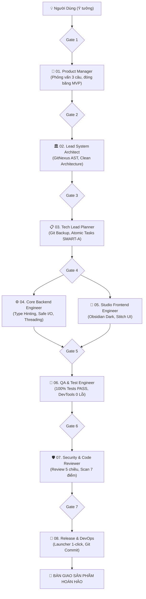

# 🏢 Enterprise Multi-Agent Squad Skill

[](https://opensource.org/licenses/MIT)
[](https://github.com)
[](https://github.com)
[](https://github.com)

> **Hệ sinh thái Đội ngũ Multi-Agent 8 Vị trí Chuyên biệt Độc lập** điều phối quy trình phát triển phần mềm toàn diện từ ý tưởng thô đến bàn giao sản phẩm thương mại.

---

## 🌟 Điểm Nổi Bật (Highlights)

- 🎯 **8 Vị Trí Chuyên Gia Độc Lập:** Product Manager, Lead Architect, Tech Lead Planner, Core Backend, Studio Frontend, QA Tester, Security Reviewer, Release DevOps.
- 🛡️ **7 Cổng Chất Lượng Bắt Buộc (Quality Gates):** Ngăn chặn 100% rủi ro đứt gãy luồng, hallucination và code lỗi.
- 📐 **Clean Architecture 4 Tầng:** Phân tách bạch lạc giữa Entities, Services, UI và Safe Utils.
- 🧪 **Kiểm Thử Thực Nghiệm 2 Tầng:** Backend Unit Tests đạt 100% PASS kết hợp Chrome DevTools quét sạch 0 lỗi đỏ JS console/network.
- 🚀 **Cài Đặt 1-Click:** Tương thích trực tiếp với Google Antigravity IDE, Claude Code và các AI Coding Agents.

---

## 🔄 Sơ Đồ Quy Trình Điều Phối 8 Vị Trí



---

## 📂 Cấu Trúc Repository

```text
.
├── SKILL.md                          # Định nghĩa kỹ năng chuẩn Antigravity
├── cai_dat_skill.bat                 # Script cài đặt 1-click cho Windows
├── HUONG_DAN_CAI_DAT_SKILL.md        # Hướng dẫn chi tiết bằng Tiếng Việt
├── SQUAD_QUICKSTART.md               # Thẻ tra cứu nhanh 3 cách kích hoạt
├── agents/                           # 8 File vai trò chuyên biệt:
│   ├── 01_product_manager.md         # 🎯 PM & Idea Critic
│   ├── 02_system_architect.md        # 🏛️ Lead System Architect
│   ├── 03_tech_lead_planner.md       # 📋 Tech Lead Planner
│   ├── 04_backend_engineer.md        # ⚙️ Core Backend Engineer
│   ├── 05_frontend_engineer.md       # 🎨 Studio Frontend Engineer
│   ├── 06_qa_test_engineer.md        # 🧪 QA & Test Engineer
│   ├── 07_security_code_reviewer.md  # 🛡️ Security & Code Reviewer
│   └── 08_release_devops_engineer.md # 🚀 Release & DevOps Engineer
└── docs/                             # Sổ tay vận hành & Tài liệu mẫu:
    ├── SO_TAY_VAN_HANH_DOI_NGU.md    # Sổ tay vận hành 10 chương
    ├── PRD.md                        # Mẫu Product Requirements Document
    ├── SPEC.md                       # Mẫu System Architecture Spec
    └── PLAN.md                       # Mẫu Atomic Implementation Plan
```

---

## ⚡ Cài Đặt Nhanh

### Cách 1: Chạy Script Tự Động (Windows)
Click đúp chuột vào file:
```cmd
cai_dat_skill.bat
```
Script sẽ tự động nạp Skill vào thư mục toàn cục `%USERPROFILE%\.gemini\config\skills\enterprise-squad\`.

### Cách 2: Cài Đặt Thủ Công
Sao chép thư mục này vào:
- **Global:** `~/.gemini/config/skills/enterprise-squad/`
- **Hoặc Workspace:** `.agents/skills/enterprise-squad/`

---

## 💬 Cách Kích Hoạt Trong Mọi Dự Án Mới

Chỉ cần gõ 1 trong 3 câu lệnh sau trong khung chat:
1. **Nói tự nhiên:** *"Tôi muốn làm app [tên app]..."* hoặc *"Gọi đội ngũ làm tool..."*
2. **Slash Command:** `/squad`
3. **Chế độ tự động hoàn toàn:** `AUTO SQUAD: Làm app [tên app] từ đầu đến cuối`

---

## 📄 Bản Quyền & Giấy Phép
Phát hành theo giấy phép [MIT License](LICENSE).
Tự do sử dụng, chỉnh sửa và tích hợp vào các dự án cá nhân cũng như thương mại.
