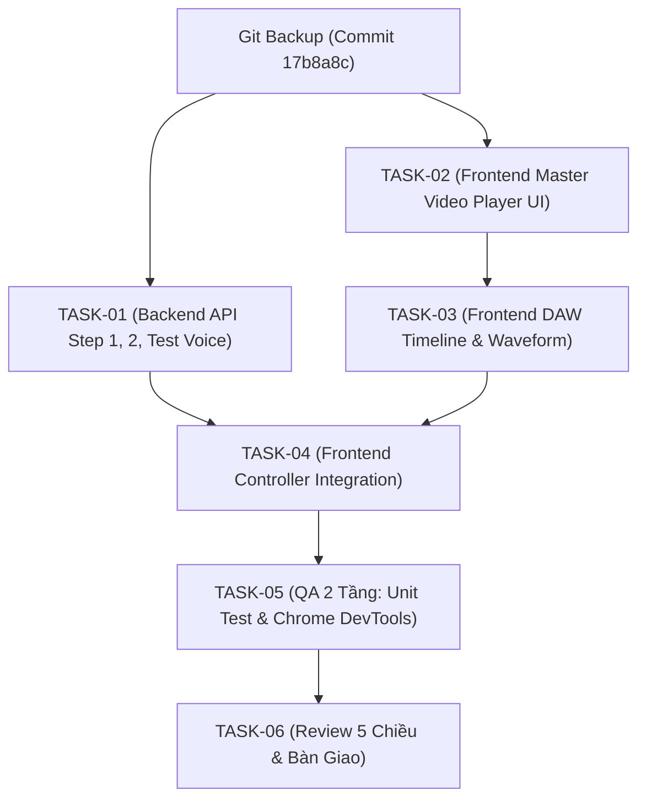

# KẾ HOẠCH THI CÔNG CHI TIẾT (IMPLEMENTATION PLAN - PLAN)

---

## 1. THÔNG TIN SPRINT
- **Tên Sprint:** Hoàn thiện Trình Phát Video Master & Bàn Dựng Timeline Đa Rãnh DAW
- **Tác giả:** Agent 03 — Quản Lý Kỹ Thuật & Điều Phối Task (Tech Lead Planner)
- **Tham chiếu:** [`docs/PRD.md`](file:///e:/app%20tools/docs/PRD.md) và [`docs/SPEC.md`](file:///e:/app%20tools/docs/SPEC.md)
- **Điểm Git Backup:** Commit `17b8a8c` (`docs: cap nhat PRD va SPEC cho module Master Video Player va Timeline DAW Studio`)
- **Chế độ thực thi:** Chế độ 1 (Step-by-Step Loop — Nghiệm thu từng Task)
- **Ngày lập:** 13/09/2026

---

## 2. BẢNG PHÂN RÃ ATOMIC TASKS (SMART-A)

| Mã Task | Tên Task & Mô Tả Chi Tiết | Người Phụ Trách | File Tác Động | Tiêu Chuẩn Chấp Thuận (Acceptance Criteria) | Phụ Thuộc |
|---|---|---|---|---|---|
| **TASK-01** | **Backend API Step 1, Step 2 & Test Voice** Bổ sung các endpoints độc lập cho Bước 1 OCR (`/api/step1-ocr`), Bước 2 Dịch (`/api/step2-translate`), và Thử âm (`/api/test-voice`). | **Agent 04** (Backend Engineer) | `web_server.py` | 1. API `/api/step1-ocr` nhận diện ROI và trả về danh sách phân đoạn câu đúng cấu trúc. 2. API `/api/step2-translate` dịch kịch bản sang ngôn ngữ đích chuẩn xác. 3. API `/api/test-voice` phát audio mẫu. 4. File `web_server.py` tiếp tục giữ < 250 dòng code. | Git Backup `17b8a8c` |
| **TASK-02** | **Nâng Cấp Trình Phát Video Master** Bổ sung nút Phụ đề Bật/Vô hiệu hóa, Nút Thử Âm cạnh thanh âm lượng, và lớp hiển thị Dual Subtitle (Gốc màu vàng, Dịch màu trắng). | **Agent 05** (Frontend Engineer) | `web/index.html` `web/style.css` | 1. Có nút `#btnTestAudio` hiển thị icon tai nghe/âm thanh. 2. Nút `#btnSubToggle` chuyển đổi mượt mà giữa Bật/Ẩn phụ đề. 3. Lớp phụ đề nổi rõ nét, không che khuất thanh điều khiển. | Không |
| **TASK-03** | **Nâng Cấp Bàn Dựng Timeline Đa Rãnh DAW** Xây dựng hệ thống 6 rãnh: Track 1 Video, Track 2 Khối Sub gốc + Nút "Tách Sub (B1)", Track 3 Khối Sub dịch + Nút "Dịch Sub (B2)", Track 4-5-6 Rãnh Sóng Âm Thoại (Waveform Canvas). Hỗ trợ nhấp chuột bất kỳ đâu nhảy video ngay đến giây đó. | **Agent 05** (Frontend Engineer) | `web/index.html` `web/timeline.js` `web/style.css` | 1. Click vào bất kỳ giây nào trên thước/track, con trỏ playhead và video nhảy ngay đến giây đó. 2. Nút B1 và B2 hiển thị sắc nét trên đầu track rãnh. 3. Rãnh 4, 5, 6 vẽ visual sóng âm Canvas động đẹp mắt phong cách DAW. | TASK-02 |
| **TASK-04** | **Tích Hợp Toàn Luồng Controller Web** Kết nối sự kiện nút B1 (Tách Sub) gọi API Step 1, nút B2 (Dịch Sub) gọi API Step 2, nút Thử Âm phát âm thanh mẫu, và đồng bộ timecode video với Timeline 2 chiều. | **Agent 05** (Frontend Engineer) | `web/app.js` | 1. Bấm B1 kích hoạt OCR và hiển thị khối sub trên Track 2. 2. Bấm B2 dịch và hiển thị khối sub trên Track 3. 3. Bấm Thử Âm phát âm thanh phản hồi. 4. Đồng bộ timecode không bị giật lag. | TASK-01, TASK-03 |
| **TASK-05** | **Kiểm Thử Thực Nghiệm 2 Tầng (Zero-Bug Policy)** Nghiệm thu Backend bằng unit tests và Frontend bằng Chrome DevTools MCP (quét 0 lỗi console đỏ, 0 lỗi network 4xx/5xx, kiểm tra click nút và chụp ảnh màn hình). | **Agent 06** (QA Test Engineer) | `tests/test_studio_daw_api.py` | 1. Unit test đạt 100% PASS. 2. Chrome DevTools báo cáo 0 lỗi Console đỏ. 3. Có ảnh chụp màn hình visual chứng minh giao diện đạt chuẩn thiết kế. | TASK-04 |
| **TASK-06** | **Review Clean Code, Security Scan & Bàn Giao** Quét 5 chiều kiến trúc, kiểm tra an toàn bảo mật không lộ key, dọn code rác, cập nhật `PROGRESS.md` và commit Git chuẩn mực. | **Agent 07** & **Agent 08** | Toàn bộ dự án | 1. Đạt 100% tiêu chí Review 5 chiều. 2. `PROGRESS.md` ghi nhận đầy đủ tiến độ. 3. Git commit Conventional Commits Tiếng Việt. | TASK-05 |

---

## 3. ĐỒ THỊ PHỤ THUỘC LUỒNG THỰC THI (DAG)

---

## 4. BIÊN BẢN BÀN GIAO CỔNG CHẤT LƯỢNG 3 (QUALITY GATE 3 SIGN-OFF)
- [x] Tài liệu `docs/PLAN.md` đã được khởi tạo hoàn chỉnh.
- [x] Đã tạo điểm Git Backup an toàn trước khi chỉnh sửa mã nguồn (Commit `17b8a8c`).
- [x] Tất cả các Task đều là Atomic Task (SMART-A), thời gian thực thi ngắn, cô lập và độc lập kiểm thử.
- [x] Phân công rõ ràng giữa Backend (Agent 04), Frontend (Agent 05), QA (Agent 06), Reviewer (Agent 07), DevOps (Agent 08).
- [x] Tiêu chuẩn nghiệm thu định lượng, có bài test xác minh cho từng bước.

👉 **KẾT QUẢ QUALITY GATE 3:** **ĐẠT (PASS 100%)**  
👉 **HÀNH ĐỘNG TIẾP THEO:** Bắt đầu triển khai **TASK-01 (Backend API)** do **Agent 04 — Core Backend Engineer** đảm nhiệm!
