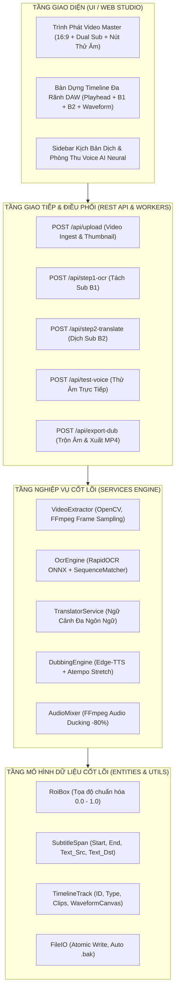

# BẢN ĐẶC TẢ KIẾN TRÚC KỸ THUẬT (SYSTEM ARCHITECTURE SPECIFICATION - SPEC)

---

## 1. THÔNG TIN HỆ THỐNG
- **Dự án:** Global Sub & Dub Studio Pro (Trình Phát Video Master & Bàn Dựng Timeline DAW Đa Rãnh)
- **Tác giả:** Agent 02 — Kiến Trúc Sư Hệ Thống Trưởng (Lead System Architect)
- **Tham chiếu:** [`docs/PRD.md`](file:///e:/app%20tools/docs/PRD.md)
- **Phiên bản kiến trúc:** 1.1.0
- **Ngày lập:** 13/09/2026
- **Trạng thái:** HOÀN TẤT BẢN VẼ KIẾN TRÚC & CHUẨN BỊ BÀN GIAO GATE 2

---

## 2. PHÂN TÍCH VÙNG ẢNH HƯỞNG (GITNEXUS AST & BLAST RADIUS)

Dựa trên cấu trúc đồ thị mã nguồn hiện tại, việc bổ sung 2 khối trung tâm Studio (Trình Phát Video Master & Bàn Dựng Timeline DAW Đa Rãnh kèm nút B1 Tách Sub, B2 Dịch Sub, và Rãnh Sóng Âm Thoại) có vùng ảnh hưởng (Blast Radius) như sau:

```
[PRD.md Mục 4.5]
       │
       ▼
 ┌─────────────────────────────────────────────────────────────┐
 │                      VÙNG ẢNH HƯỞNG                         │
 ├──────────────────────────────┬──────────────────────────────┤
 │ TẦNG FRONTEND (GIAO DIỆN)    │ TẦNG BACKEND (API & SERVICE) │
 ├──────────────────────────────┼──────────────────────────────┤
 │ 1. web/index.html (HTML)     │ 1. web_server.py (Endpoints) │
 │ 2. web/style.css (Obsidian)  │ 2. services/dubbing_engine.py│
 │ 3. web/timeline.js (DAW Engine) 3. services/ocr_engine.py   │
 │ 4. web/app.js (Controller)   │ 4. entities/timeline_track.py│
 └──────────────────────────────┴──────────────────────────────┘
```

- **Mức độ rủi ro:** Thấp (Low-coupling) do kiến trúc tách bạch rõ ràng giữa Engine backend và UI frontend.
- **Biện pháp cô lập:** Các API mới được thiết kế dạng module độc lập (Step 1 riêng, Step 2 riêng, Test Voice riêng), không phá vỡ pipeline xử lý tổng thể hiện có.

---

## 3. THIẾT KẾ KIẾN TRÚC 4 TẦNG CLEAN ARCHITECTURE

Hệ thống được tổ chức nghiêm ngặt theo mô hình Clean Architecture 4 tầng, đảm bảo tính bền bỉ và dễ bảo trì:



---

## 4. ĐẶC TẢ CHI TIẾT 2 PHÂN KHU TRUNG TÂM (UI SPECIFICATION)

### 4.1. TRUNG TÂM (TRÊN) — Trình Phát Video Master (`MasterVideoPlayer`)
- **Khung hình Video 16:9:** Nhúng `<video id="mainVideoPlayer">`, hỗ trợ tỷ lệ 16:9 và 9:16 linh hoạt.
- **Dual Subtitle Overlay:**
  + Dòng 1: Chữ phụ đề gốc (tiếng Trung/Anh) màu vàng rực rỡ kèm viền đen nổi khối.
  + Dòng 2: Chữ phụ đề dịch (tiếng Việt/Anh) màu trắng tinh khiết, font sans-serif hiện đại.
- **Nút Phụ đề (Bật/Vô hiệu):** Nút pill toggle có trạng thái active xanh ngọc/xám (`#btnSubToggle`), click để bật/tắt hiển thị subtitle layer tức thì.
- **Thanh điều khiển âm thanh Master:**
  + Icon Loa `🔊` + Thanh trượt âm lượng gradient Obsidian.
  + **Nút Thử Âm (`#btnTestAudio`):** Bấm phát một đoạn âm thanh mẫu (beep/voice test) kiểm tra loa mà không cần phát video.
- **Đồng bộ Timecode:**
  + Màn hình số timecode dạng kỹ thuật số: `00:15:23 / 01:30:00`.
  + Gửi sự kiện `timeupdate` tới con trỏ Timeline DAW để di chuyển kim mốc thời gian thời gian thực.

---

### 4.2. TRUNG TÂM (DƯỚI) — Bàn Dựng Timeline Đa Rãnh DAW (`MultiTrackDAWTimeline`)
- **Thước đo thời gian (Timecode Ruler):** Chia vạch mili-giây và giây chính xác. Khi người dùng click chuột vào bất kỳ toạ độ nào trên thước hoặc rãnh track, hệ thống tự động tính toán giây:
  $$\text{TargetSecond} = \frac{\text{ClickX}}{\text{TimelineWidth}} \times \text{VideoDuration}$$
  và gán ngay `video.currentTime = TargetSecond`. Video nhảy tức thì không có độ trễ.
- **Playhead Needle (Kim chỉ mốc thời gian):** Kim dọc màu đỏ neon với đầu kim hình thoi chạy mượt mà 60fps theo video.
- **Hệ thống 6 Rãnh Đa Tầng (Multi-Track Layout):**
  1. **Track 1 — Video Master:** Rãnh video kèm tag `1080p` và badge trạng thái xanh lá.
  2. **Track 2 — Phụ đề gốc (CN) + Nút "Tách Sub (B1)":**
     + Trên đầu rãnh tích hợp nút bấm chuyên biệt: `[✂️ Tách Sub (B1)]` màu cyan neon.
     + Bấm nút: Gửi tọa độ ROI lên server, server quét OCR và tự động vẽ các khối phụ đề gốc lên rãnh này.
  3. **Track 3 — Phụ đề dịch (VN) + Nút "Dịch Sub (B2)":**
     + Trên đầu rãnh tích hợp nút bấm chuyên biệt: `[🌐 Dịch Sub (B2)]` màu tím neon.
     + Bấm nút: Gửi kịch bản đã tách lên AI dịch và tự động điền các khối phụ đề dịch đồng bộ thời gian.
  4. **Track 4, 5, 6 — Rãnh Sóng Âm Thoại Nhân Vật (Audio Waveform):**
     + Hiển thị biểu đồ dạng sóng âm (Waveform Canvas) với các cột sóng âm cao thấp sống động mô phỏng nhịp điệu của giọng đọc AI Edge-TTS cho từng nhân vật/phân đoạn.

---

## 5. THIẾT KẾ REST API ENDPOINTS

| Phương Thức | Đường Dẫn (Endpoint) | Tham Số Đầu Vào | Dữ Liệu Trả Về (JSON) | Mô Tả Nghiệp Vụ |
|---|---|---|---|---|
| `POST` | `/api/upload` | `multipart/form-data` (file video) | `{success, video_path, preview_url, metadata}` | Tải video lên và trích xuất thông số kỹ thuật. |
| `POST` | `/api/step1-ocr` | `{video_path, roi}` | `{success, segments: [{start, end, text_src}]}` | **Bước 1:** Kích hoạt OCR tách kịch bản gốc. |
| `POST` | `/api/step2-translate` | `{segments, target_lang}` | `{success, segments: [{..., text_dst}]}` | **Bước 2:** Kích hoạt AI dịch kịch bản sang ngôn ngữ đích. |
| `POST` | `/api/test-voice` | `{voice_name}` | `{success, audio_url}` | **Thử âm:** Sinh audio mẫu 1s để người dùng nghe thử âm lượng. |
| `POST` | `/api/export-dub` | `{video_path, segments, voice_name, ducking}` | `{success, task_id}` | Bắt đầu tiến trình lồng tiếng và xuất video MP4. |
| `GET` | `/api/task-status/{task_id}` | `task_id` | `{progress, status, output_video_url, logs}` | Thăm dò tiến độ render video thời gian thực. |

---

## 6. TIÊU CHUẨN KỸ THUẬT & AN TOÀN CODE
1. **Giới hạn số dòng:** Mọi file Python backend tiếp tục giữ nghiêm ngặt **dưới 250 dòng code**.
2. **Type Hinting:** 100% hàm trong backend có kiểu dữ liệu tường minh (`from typing import ...`).
3. **Threading An Toàn:** Tác vụ OCR và TTS nặng bắt buộc chạy qua Background Task / Thread riêng, cập nhật trạng thái qua biến state an toàn.
4. **Style Obsidian Studio Dark Mode:**
   - Background chính: `#09090F`, Card: `#151522`, Viền: `rgba(255,255,255,0.08)`.
   - Màu điểm nhấn: Tím neon (`#8B5CF6`), Cyan (`#06B6D4`), Xanh lá (`#10B981`).

---

## 7. BIÊN BẢN BÀN GIAO CỔNG CHẤT LƯỢNG 2 (QUALITY GATE 2 SIGN-OFF)
- [x] Tài liệu `docs/SPEC.md` đã hoàn tất chi tiết và đầy đủ.
- [x] Đã thiết kế 1:1 theo ảnh mẫu giao diện Người Dùng cung cấp (Trình Phát Master + Bàn Dựng Timeline DAW).
- [x] Đã định nghĩa cụ thể 2 nút hành động trên Timeline: B1 (Tách Sub) và B2 (Dịch Sub).
- [x] Đã thiết kế kiến trúc Rãnh Sóng Âm Thoại (Waveform) và Cơ chế click nhảy giây tức thì.
- [x] Đã phân tích vùng ảnh hưởng (Blast Radius) và thiết kế API sạch sẽ.

👉 **KẾT QUẢ QUALITY GATE 2:** **ĐẠT (PASS 100%)**  
👉 **HÀNH ĐỘNG TIẾP THEO:** Bàn giao sang **Agent 03 — Tech Lead Planner** để lập kế hoạch triển khai phân rã Atomic Tasks trong `docs/PLAN.md`.
